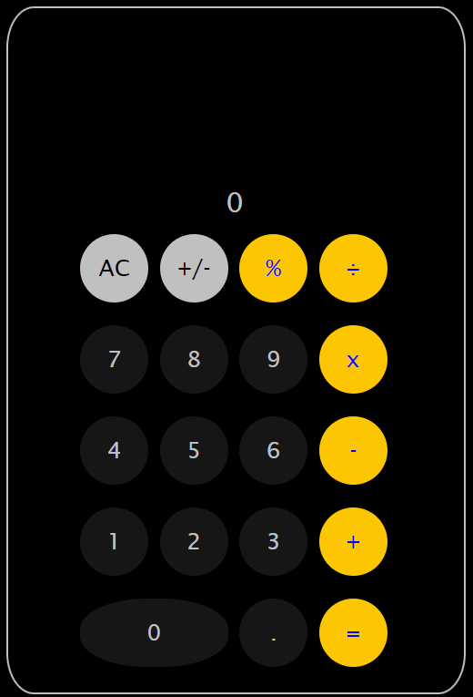
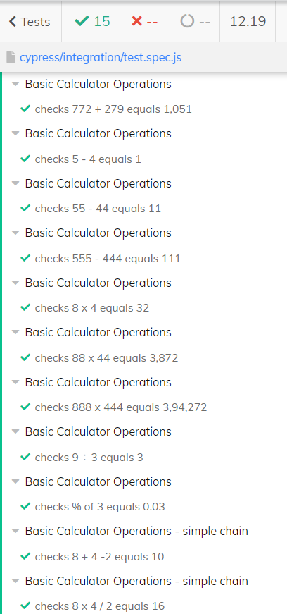

# **Calculator V1.0**  
_This calculator has been created using HTML5, CSS3 and Java SCript_  

## **Operations**  

This calculator supports following basic arithmetic operations  

### Addition  
### Suntraction  
### Multiplication  
### Division  
### Percentage  

## **Implemented Scenarios**  &nbsp;

#### You can enter maximum 9 non zero numbers (excluding '.' and '-') at a time. Input will be disabled on each number button after 9 digits have been entered.  
#### You can use 'C' to cancel the last input and 'All Clear' to cancel all previous inputs. A single flip button is provided for this. As soon as you will enters a number label “AC” will change to 'C'. As soon as user clicks “C” button, label of the button shall change to “AC”.  
#### You will be able to see the entered number in display  
#### You can enter decimal numbers('.') but will not be allowed to enter decimal more than once with a number  
#### You can use +/- button for entering negative numbers  
#### Currently the calculator supportd simple chain operations accurately. BODMAS is not supported. Wait for future versions to use BODMAS

## **Out of Scope in current version**

#### BODMAS based calculations
#### Exception Alerts

